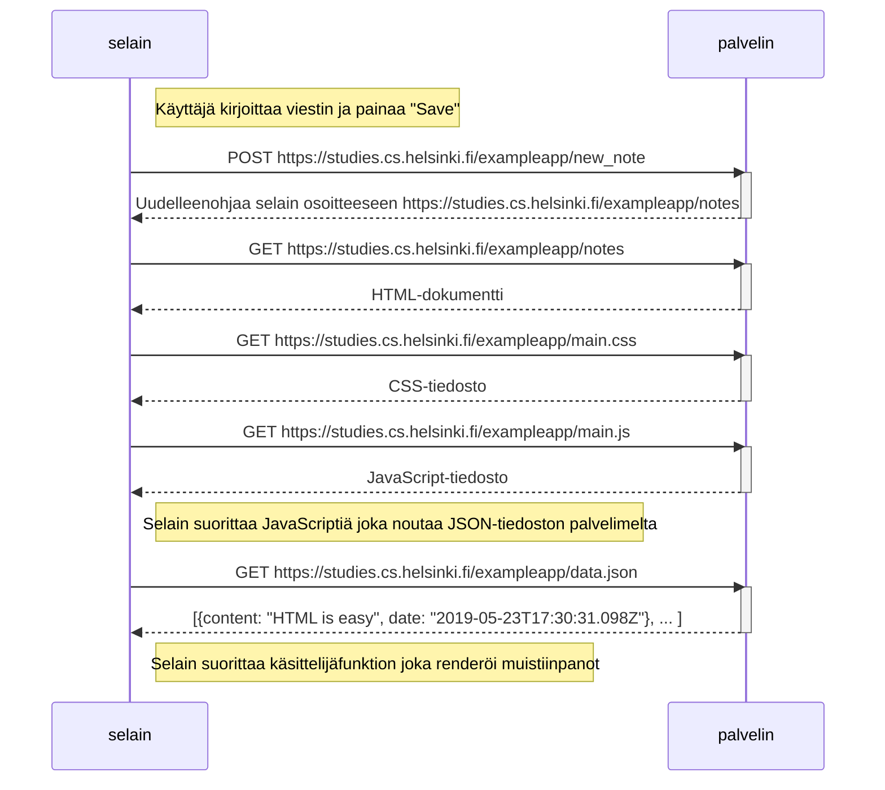

```mermaid
sequenceDiagram
    participant selain
    participant palvelin

    Note right of selain: Käyttäjä kirjoittaa viestin ja painaa "Save"

    selain->>palvelin: POST https://studies.cs.helsinki.fi/exampleapp/new_note
    activate palvelin
    palvelin-->>selain: Uudelleenohjaa selain osoitteeseen https://studies.cs.helsinki.fi/exampleapp/notes
    deactivate palvelin
    
    selain->>palvelin: GET https://studies.cs.helsinki.fi/exampleapp/notes
    activate palvelin
    palvelin-->>selain: HTML-dokumentti
    deactivate palvelin
    
    selain->>palvelin: GET https://studies.cs.helsinki.fi/exampleapp/main.css
    activate palvelin
    palvelin-->>selain: CSS-tiedosto
    deactivate palvelin
    
    selain->>palvelin: GET https://studies.cs.helsinki.fi/exampleapp/main.js
    activate palvelin
    palvelin-->>selain: JavaScript-tiedosto
    deactivate palvelin
    
    Note right of selain: Selain suorittaa JavaScriptiä joka noutaa JSON-tiedoston palvelimelta
    
    selain->>palvelin: GET https://studies.cs.helsinki.fi/exampleapp/data.json
    activate palvelin
    palvelin-->>selain: [{content: "HTML is easy", date: "2019-05-23T17:30:31.098Z"}, ... ]
    deactivate palvelin    

    Note right of selain: Selain suorittaa käsittelijäfunktion joka renderöi muistiinpanot
```
